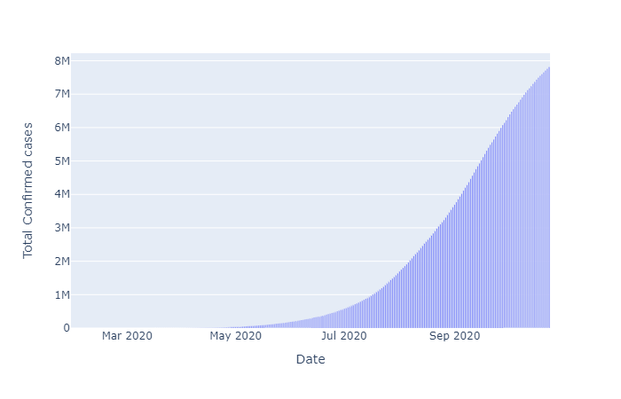
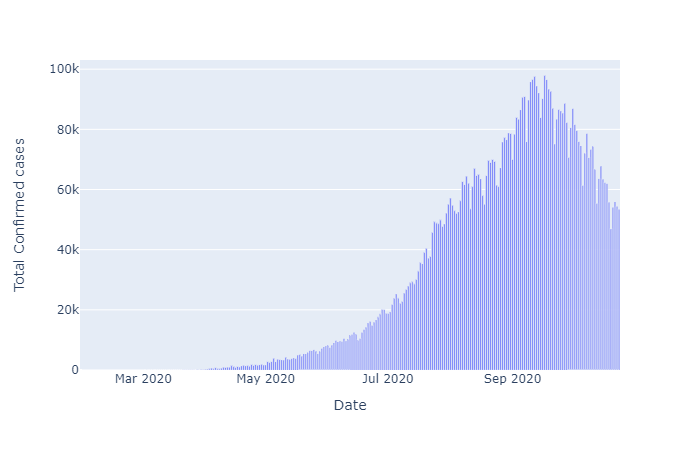
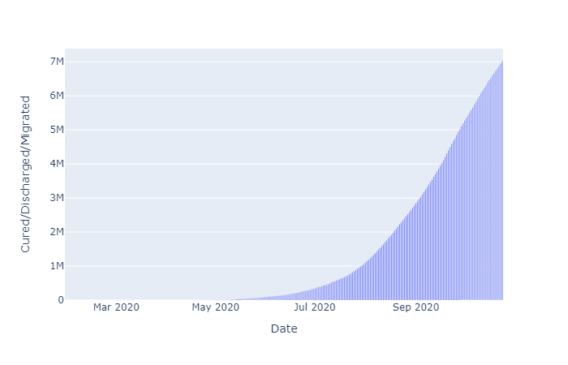
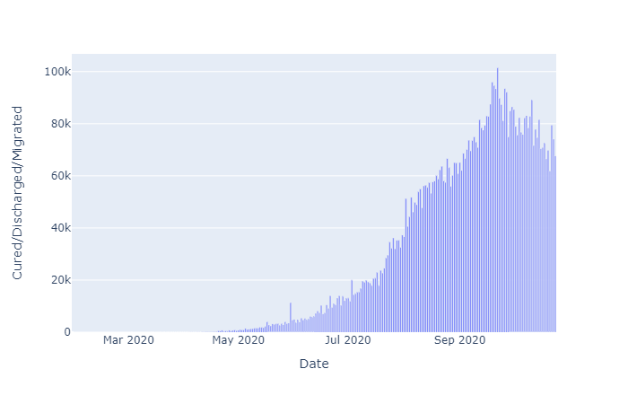
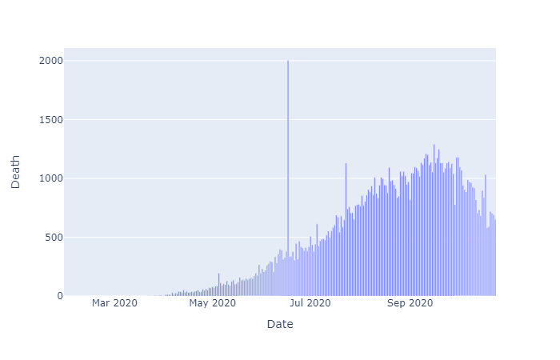

In this project I have analysed the Covid-19 India statistics using various data exploratory libraries.

Data source: https://www.kaggle.com/

The total number of Covid-19 cases are rising daily as new cases are adding up everyday.

While the Daily changes in number of cases have dropped over past few days.

The total number of cases that have been cured are also rising as more and more people are getting recovered everyday.

And the number of cases that are being cured daily have dropped over the past few weeks as the daily number of new cases have dropped also.

The total number of people who have died are rising but at a very low rate as the recovery rate is much higher than the death rate.

The number of people who are dying daily have seen a significant drop as the time passes
