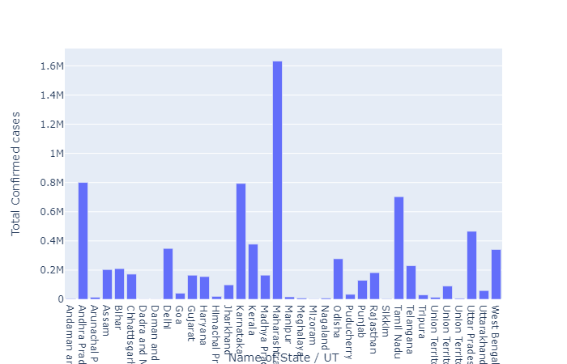
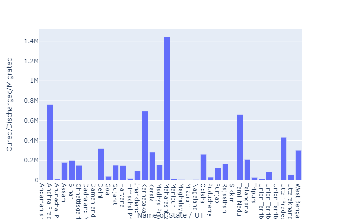
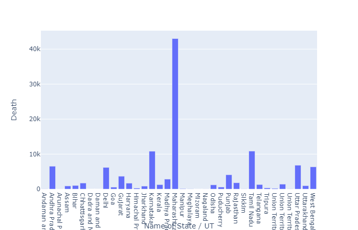

In this project I have analysed the Covid-19 India statistics using various data exploratory libraries.

Data source: https://www.kaggle.com/

The total number of Covid-19 cases are rising daily as new cases are adding up everyday.

While the Daily changes in number of cases have dropped over past few days.

These are the total number of cases in each State and UT.

Here we see the total number of cases that have been cured.

Here we see the number of cases that have been cured daily.

Here we see the total number of cases that have been cured in each State and UT.

Here we see the total number of people who have died.

Here we see the number of people who have died daily.

Here we see the total number of people who have died in each State and UT.
